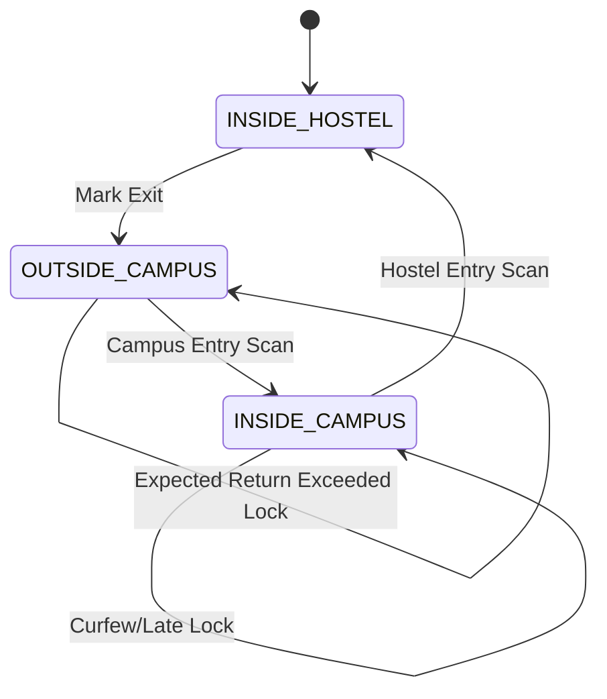

# HostelEase Architecture

## Role Model

The system uses role-based authorization with three primary roles:

- **student**
  - Requests gate passes.
  - Generates QR tokens for entry scans.
  - Views own gate state and pass history.
- **gatekeeper**
  - Marks exits.
  - Scans campus-entry and hostel-entry QR tokens.
  - Views outside-student list.
- **admin**
  - Approves/rejects passes.
  - Views logs, late entries, and operational metrics.
  - Performs unlock and override actions.

Role authorization is enforced by `authMiddleware` and `requireRoles` on protected routes.

## Gate State Diagram

State transitions are validated in gate routes before token consumption and persistence.

## Token Lifecycle

1. Student requests signed QR token for a specific stage (`CAMPUS_ENTRY` or `HOSTEL_ENTRY`).
2. Server signs payload using HMAC secret and sets TTL.
3. Gatekeeper scans token and server validates:
   - signature
   - stage
   - expiry
   - replay/consumption eligibility
4. Token is consumed only after transition preconditions pass.
5. Scan outcome is persisted for audit (`SUCCESS` or `REJECTED`).

## Late-Lock Flow

Late lock can be applied through multiple paths:

- Campus-entry scan after expected return time.
- Hostel-entry scan after expected return time.
- Periodic late-check background service when expected return is exceeded.
- Curfew monitor after configured cutoff when user remains inside campus without hostel entry.

Effects of late lock:

- `attendanceLocked = true` on `StudentGateState`.
- Pass status transitions to `LATE` when applicable.
- System action logs and structured event logs are emitted.

## Background Services

Two singleton interval services are started from route bootstrap:

- **Curfew Monitor**
  - Checks cutoff-based violations.
  - Applies late lock when rule conditions are met.
- **Late Check Service**
  - Detects expected-return violations for active passes.
  - Applies lock and audit actions.

Both services use guarded interval initialization to prevent duplicate schedulers.

## Failure Handling Notes

- Validation failures return structured 4xx errors from route handlers.
- Security middleware applies rate limiting, sanitization, and request timeout protections.
- Central error middleware avoids stack trace leakage in production mode.
- Request logs in production are minimized to method/path/status/duration.
- Structured system events are additive and non-blocking side effects.
